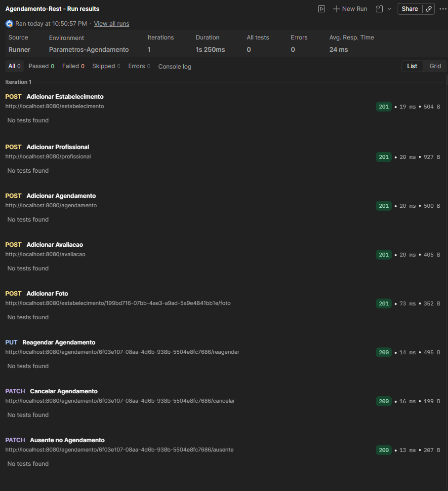

# POS-TECH - Atividade substitutiva

API desenvolvida para o Tech Challenge de Arquitetura Java da FIAP, com foco no gerenciamento de agendamentos para serviços de beleza e bem-estar. O projeto centraliza o cadastro de estabelecimentos e profissionais, o agendamento de atendimentos, o registro de avaliações e a consulta de disponibilidade e busca avançada via GraphQL.

## Objetivo do projeto

Esta aplicação atende ao cenário de uma plataforma de agendamento em que o cliente pode:

- consultar estabelecimentos e profissionais;
- verificar horários disponíveis;
- criar, reagendar, cancelar e registrar ausência em agendamentos;
- avaliar atendimentos realizados;
- visualizar dados do domínio por REST e GraphQL.

## Tecnologias utilizadas

- Java 21
- Spring Boot 4
- Spring Web MVC
- Spring Data JPA
- Spring for GraphQL
- PostgreSQL
- Maven
- Lombok
- MapStruct
- Springdoc OpenAPI / Swagger UI
- Docker e Docker Compose
- JaCoCo
- Postman

## Organização da solução

O projeto está estruturado em camadas, separando responsabilidades entre:

- `domain`: entidades e regras centrais do negócio;
- `application`: casos de uso, DTOs de entrada/saída e contratos de gateway;
- `infrastructure`: APIs REST/GraphQL, persistência JPA, presenters, configurações e armazenamento de arquivos.

Essa organização facilita a evolução, testes e substituição de detalhes de infraestrutura sem acoplar as regras de negócio aos frameworks.

## Funcionalidades implementadas

### REST

- cadastro de estabelecimento;
- upload de foto para estabelecimento;
- cadastro de profissional com especialidades, serviços e horários;
- criação de agendamento;
- reagendamento de agendamento;
- cancelamento de agendamento;
- registro de ausência do cliente;
- registro de avaliação;
- atualização da média de notas do estabelecimento após novas avaliações;
- validação de existência de estabelecimento, profissional e agendamento antes de executar os fluxos.

As especificações OpenAPI estão em `src/main/resources/api` e são usadas para gerar as interfaces REST da aplicação.

### GraphQL

- busca de estabelecimentos com filtros combinados;
- consulta de disponibilidade de profissional por data;
- consulta de profissionais, serviços oferecidos, fotos e endereço do estabelecimento em uma única resposta.

O schema principal está em `src/main/resources/graphql/schema.graphqls`, e a coleção Postman com exemplos de chamadas está em `docs/postman`.

## Como o projeto contempla os requisitos da Fase 3

Considerando o escopo implementado nesta base e o material de apoio presente em `docs/Tech Challenge - JAVA - Fase 3..pdf`, o projeto cobre os principais requisitos funcionais da fase da seguinte forma:

| Requisito esperado               | Como está contemplado no projeto |
|----------------------------------| --- |
| Cadastro de estabelecimentos     | Endpoint REST para criação de estabelecimentos com endereço e horários de funcionamento |
| Cadastro de profissionais        | Endpoint REST para associar profissionais a estabelecimentos, com especialidades, serviços e agenda de horários |
| Gestão de agendamentos           | Endpoints REST para criar, reagendar, cancelar e registrar ausencia |
| Lembretes automáticos de agendamento | Job em `infrastructure/schedule/LembreteAgendamentoSchedule` executa o `LembreteAgendamentoUseCase` diariamente para enviar lembretes de atendimentos do próximo dia por e-mail |
| Avaliação do atendimento         | Endpoint REST para registrar nota e comentário vinculados ao agendamento |
| Consulta de disponibilidade      | Query GraphQL `disponibilidadeProfissional` retorna apenas os horários livres para a data informada |
| Busca avançada de estabelecimentos | Query GraphQL `buscarEstabelecimentos` permite filtrar por dados do estabelecimento, endereço, faixa de nota, servico, faixa de preço e horário |
| Documentação e exploração da API | OpenAPI/Swagger para REST e schema GraphQL/Postman para consultas e testes |
| Persistência relacional          | Integração com PostgreSQL usando Spring Data JPA |
| Execução conteinerizada          | `Dockerfile` e `docker-compose.yml` para subir aplicação e banco |

### Observação importante

Foi implementado o envio de e-mails de notificação e lembrete de agendamentos, incluindo execução automática diária via scheduler.
A sincronização de calendário permanece como estrutura base, sem implementação completa nesta fase.

## Como executar

### Requisitos

- Java 21
- Maven 3.9+
- Docker e Docker Compose

### Subindo com Docker

```bash
docker compose up --build
```

A aplicação sobe em `http://localhost:8080` e o PostgreSQL em `localhost:5432`.

### Executando localmente com Maven

```bash
./mvnw spring-boot:run
```

No Windows:

```bash
mvnw.cmd spring-boot:run
```

### Configuração do envio de email

O projeto utiliza as propriedades `spring.mail.*` parametrizadas por variáveis de ambiente no arquivo `src/main/resources/application.properties`.

Para usar uma conta Gmail no envio SMTP, crie um arquivo `.env` na raiz do projeto com os parâmetros abaixo:

```dotenv
MAIL_HOST=smtp.gmail.com
MAIL_PORT=587
MAIL_USERNAME=seu-email@gmail.com
MAIL_PASSWORD=sua-app-password-de-16-caracteres
MAIL_SMTP_AUTH=true
MAIL_SMTP_STARTTLS_ENABLE=true
```

As variáveis esperadas pela aplicação são:

- `MAIL_HOST`: servidor SMTP. Para Gmail, use `smtp.gmail.com`;
- `MAIL_PORT`: porta SMTP. Para Gmail com STARTTLS, use `587`;
- `MAIL_USERNAME`: email da conta remetente;
- `MAIL_PASSWORD`: App Password de 16 caracteres gerada na conta Google;
- `MAIL_SMTP_AUTH`: habilita autenticacao SMTP;
- `MAIL_SMTP_STARTTLS_ENABLE`: habilita STARTTLS.

### Configuração do agendamento de lembrete

O agendamento que dispara o `LembreteAgendamentoUseCase` esta em `src/main/java/com/fiap/pos_tech/agendamento_servicos/infrastructure/schedule/LembreteAgendamentoSchedule.java`.

As propriedades de configuração são:

- `scheduler.lembrete-agendamento.cron`: expressão cron do Spring (6 campos);
- `scheduler.lembrete-agendamento.zone`: timezone da execução.

Valores padrão no código:

- `scheduler.lembrete-agendamento.cron=0 0 8 * * *` (todos os dias às 08:00);
- `scheduler.lembrete-agendamento.zone=America/Sao_Paulo`.

Para executar a cada 5 minutos no `docker-compose.yml`, adicione no serviço `app`:

```yaml
environment:
 # ...demais variaveis
 SCHEDULER_LEMBRETE_AGENDAMENTO_CRON: "0 */5 * * * *"
 SCHEDULER_LEMBRETE_AGENDAMENTO_ZONE: "America/Sao_Paulo"
```

Importante: o Spring Boot não carrega o arquivo `.env` automaticamente. Antes de iniciar a aplicação, carregue as variáveis no terminal.

Quando a aplicação for iniciada com `docker compose`, esse carregamento manual não é necessário, porque o Compose já utiliza o arquivo `.env` automaticamente.

No PowerShell:

```powershell
Get-Content .env | ForEach-Object {
 if ($_ -match '^\s*#' -or $_ -match '^\s*$') { return }
 $name, $value = $_ -split '=', 2
 [System.Environment]::SetEnvironmentVariable($name, $value, 'Process')
}
mvnw.cmd spring-boot:run
```

### Como gerar a senha de 16 caracteres no Gmail

Para usar SMTP do Gmail, não utilize a senha normal da conta. Gere uma App Password de 16 caracteres e use esse valor em `MAIL_PASSWORD`.

Passo a passo:

1. Acesse a sua Conta Google em `https://myaccount.google.com/`.
2. Entre em `Seguranca`.
3. Ative a verificação em duas etapas, caso ainda não esteja habilitada.
4. Volte para a área de segurança e acesse `Senhas de app` ou pesquise na barra de pesquisa do canto superior `Senhas de app`'
5. Informe um nome para identificar o uso da senha, por exemplo `pos-tech-smtp`.
6. Clique em `Gerar`.
7. Copie a senha de 16 caracteres exibida pelo Google.
8. Preencha esse valor na variável `MAIL_PASSWORD`.

Observações:

- se a opção `Senhas de app` não aparecer, normalmente a verificação em duas etapas ainda não foi ativada ou a conta possui alguma restrição de segurança;
- a senha gerada e exibida sem espaços no arquivo `.env`, mesmo que o Google a mostre agrupada visualmente;
- o remetente usado pela aplicação será o mesmo valor informado em `MAIL_USERNAME`.

## Dados e documentação

- `src/main/resources/application.properties`: configuração local do datasource;
- `src/main/resources/data.sql`: carga inicial de clientes;
- `docs/postman`: coleção Postman com exemplos REST e GraphQL;
- `docs/export-postman`: exportacao pronta para uso no Postman com a collection `Agendamento-Rest.postman_collection.json` e o environment `Parametros-Agendamento.postman_environment.json`;
- `src/main/resources/api/*.yaml`: contratos OpenAPI;
- `src/main/resources/graphql/schema.graphqls`: schema GraphQL.

## Endpoints úteis

- Swagger UI: `http://localhost:8080/swagger-ui.html`
- GraphQL: `http://localhost:8080/graphql`

## Testes

O projeto possui diferentes níveis de testes automatizados em `src/test/java`, com cobertura via JaCoCo:

- testes unitários dos casos de uso, cobrindo validações e regras de negócio;
- testes de integração REST e GraphQL com `MockMvc`, validando o fluxo completo de cadastro, agendamento, reagendamento, cancelamento, ausência e avaliacao;
- teste de carga com Gatling para o endpoint `POST /agendamento`.

### Como executar os testes

Para executar a suite automatizada:

```bash
./mvnw test
```

No Windows:

```bash
mvnw.cmd test
```

Para gerar a cobertura com JaCoCo:

```bash
./mvnw verify
```

No Windows:

```bash
mvnw.cmd verify
```

Para executar apenas o teste de carga com Gatling, com a aplicação já iniciada:

```bash
mvnw.cmd gatling:test -Dgatling.simulationClass=com.fiap.pos_tech.agendamento_servicos.performance.AgendamentoCargaSimulation
```

Mais detalhes sobre o cenário de carga estão em `docs/gatling-agendamento.md`.

## Testes manuais com Postman

Na pasta `docs/export-postman` estão os arquivos prontos para importação no Postman:

- `Agendamento-Rest.postman_collection.json`;
- `Parametros-Agendamento.postman_environment.json`.

Importe os dois arquivos para executar os testes manuais. A ordem de execução da collection deve ser mantida, porque os scripts de teste das primeiras requisições salvam automaticamente no environment os identificadores retornados pela API, como `estabelecimento_id`, `profissional_id`, `servico_id` e `agendamento_id`, que são reutilizados nas requisições seguintes.

Segue um exemplo da execução em sequencia no postman utilizando o Collection Runner.




### Observação:

Na execução da request `Adicionar Foto` é necessário adicionar no body um arquivo de imagem.
Caso o arquivo de imagem selecionado esteja fora do diretório de trabalho do postman, o Collection Runner por questão de segurança não irá anexar o arquivo e irá apresentar o erro de `Unsupported Media Type`

Para evitar esse erro é necessário ativar a opção `Permitir leitura de arquivos fora do diretório de trabalho` seguindo os passos abaixo:

- Acesse as Configurações (Settings) do seu Postman.
- Navegue até a seção Working Directory.
- Ative a opção "Allow reading files outside working directory" (Permitir leitura de arquivos fora do diretório de trabalho).

Alternativamente, mova o arquivo físico do seu upload para dentro da pasta padrão configurada no Working Directory (geralmente ~/Postman/files) e anexe novamente o arquivo na aba Body da sua requisição antes de iniciar o Collection Runner.
